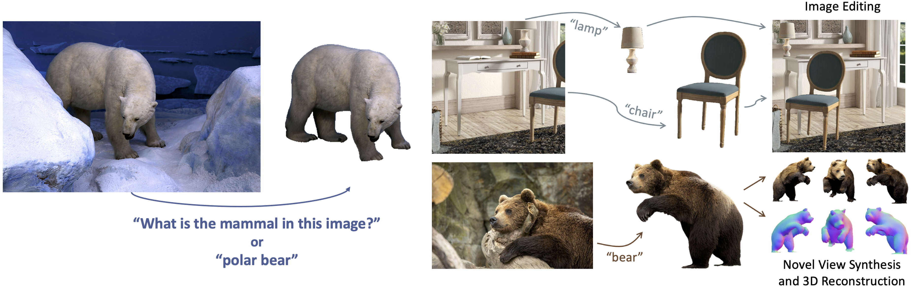
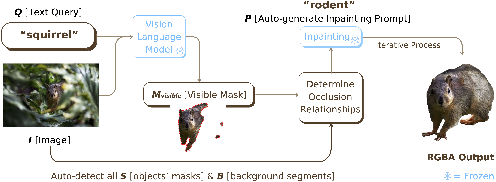

# Open-World Amodal Appearance Completion (CVPR2025)

<p align="center">
  <p align="center" margin-bottom="0px">
    <a href="https://jiayangao.github.io/"><strong>Jiayang Ao</strong></a>
    ·
    <a href="https://cis.unimelb.edu.au/research/artificial-intelligence/ai-students/artificial-intelligence/yanbei-jiang"><strong>Yanbei Jiang</strong></a>
    ·
    <a href="https://research.monash.edu/en/persons/qiuhong-ke/"><strong>Qiuhong Ke</strong></a>
    ·
    <a href="http://www.kehinger.com/"><strong>Krista A. Ehinger</strong></a>
    <p align="center">
    <a href="https://arxiv.org/abs/2411.13019" style="text-decoration:none;">
      
    </a>
    <a href="https://cvpr.thecvf.com/Conferences/2025/AcceptedPapers" style="text-decoration:none;">
      
    </a>
    <a href="https://opensource.org/license/apache-2-0" style="text-decoration:none;">
      
    </a>
  </p>
</p>

## Introduction
<p align="justify">
We introduce a training-free framework that expands amodal completion capabilities by accepting flexible text queries as input. Our approach generalizes to arbitrary objects specified by both direct terms and abstract queries. We term this capability reasoning amodal completion, where the system <strong>reconstructs the full appearance of the queried object based on the provided image and language query</strong>. Our framework unifies segmentation, occlusion analysis, and inpainting to handle complex occlusions and generates completed objects as RGBA elements, enabling seamless integration into applications such as 3D reconstruction and image editing.
</p>




## Methodology
<p align="justify">
Overview of our framework. Starting with a text query, a VLM generates a visible mask to locate the target object in the input image. The framework then identifies all objects and background segments for occlusion analysis. An auto-generated prompt guides the inpainting model, which iteratively reconstructs the occluded object to produce a transparent RGBA amodal completion output.
</p>




## Getting Started

We will update the code very soon.

### License

This project is licensed under the Apache License 2.0 - see the [LICENSE](https://github.com/saraao/amodal/blob/main/LICENSE) file for details.

### Acknowledgments

We thank the following papers for their open-source code and datasets:
- Amodal Completion via Progressive Mixed Context Diffusion [[CVPR 2024]](https://github.com/k8xu/amodal)
- LISA: Reasoning Segmentation via Large Language Model [[CVPR 2024]](https://github.com/dvlab-research/LISA)  


## Citation

If you find this helpful in your work, please consider citing our paper:
```
@article{ao2024open,
  title={Open-World Amodal Appearance Completion},
  author={Ao, Jiayang and Jiang, Yanbei and Ke, Qiuhong and Ehinger, Krista A},
  journal={arXiv preprint arXiv:2411.13019},
  year={2024}
}
```

# Contact
If you have any questions regarding this work, please send email to jiayang.ao@student.unimelb.edu.au.
